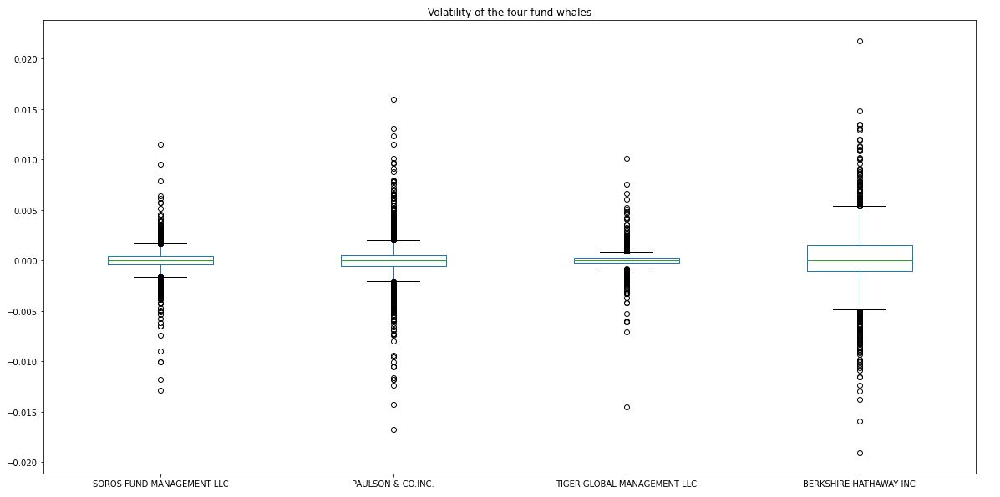
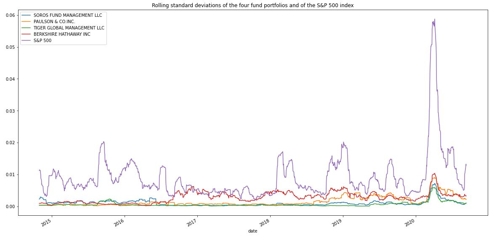
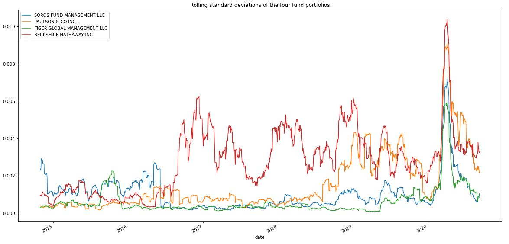
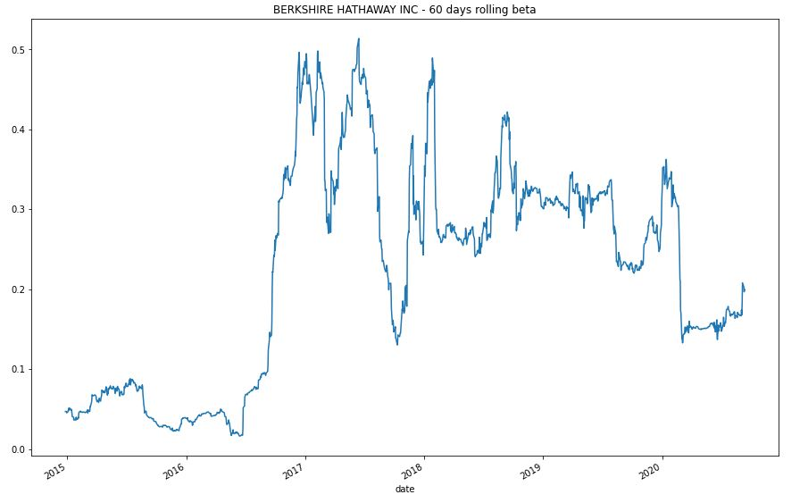
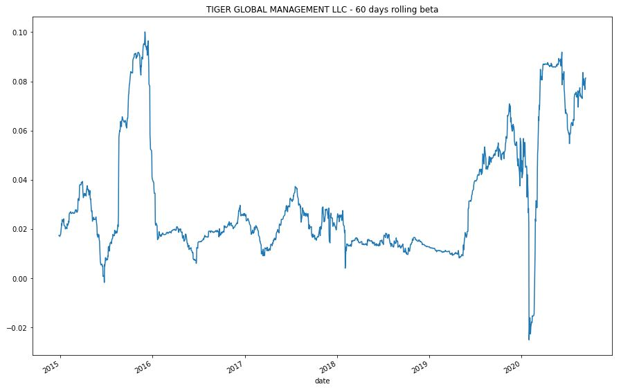

# Analyzing Portfolio Risk and Return

This analysis contains evaluating of four new investment options for inclusion in the client portfolios. In particular, determining the fund with the most investment potential based on key risk-management metrics: the daily returns, standard deviations, Sharpe ratios, and betas.

Funds for analizyng:
* S&P 500
* BERKSHIRE HATHAWAY INC
* TIGER GLOBAL MANAGEMENT LLC
* PAULSON & CO.INC.
* SOROS FUND MANAGEMENT LLC

---

## Approach and phases of analizing

It is quantitive analysis that includes the following:: 
* Performance, 
* Volatility, 
* Risk,
* Risk-return profile
* Portfolio diversification

---

## Technologies

This project leverages the following tools for financial analysis:

* [Pandas](https://pandas.pydata.org) - Python library that’s designed specifically for data analysis.

* [JupyterLab](https://jupyter.org) - For running and review Python-based programs.

---

## Input data

Input data is in the Resources folder:

* whale_navs.csv - close prices for 5 funds (pls, see names in the title)

## Analizing summaries (results)

The analizing is focused on comparing assets that DataFrame contains vs. S&P500.

### Analyzing the Volatility

Based on the box plot visualization of just the four fund portfolios, BERKSHIRE HATHAWAY INC is the most volatile (with the greatest spread) and TIGER GLOBAL MANAGEMENT LLC is the least volatile (with the smallest spread).



### Analyzing the Risk

Based on the annualized standard deviation, BERKSHIRE HATHAWAY INC pose more risk than the S&P 500. Annualized standart deviation is 0.051692.
```
TIGER GLOBAL MANAGEMENT LLC    0.015804
SOROS FUND MANAGEMENT LLC      0.022297
PAULSON & CO.INC.              0.034912
BERKSHIRE HATHAWAY INC         0.051692
S&P 500                        0.183345
```
Based on the rolling metrics, we can say that risk of each portfolio increased at pretty same time at the beginning of 2019 because violity.



Based on the rolling standard deviations of only the four fund portfolios, most volatile stock is BERKSHIRE HATHAWAY INC, it is most risky portfolio. But if we check whole period, BERKSHIRE HATHAWAY INC 's volatile was on pretty same level with the other stocks and started to change a lot in the middle of 2016.



### Analyze the Risk-Return Profile

Dased on results, PAULSON & CO.INC. is the worst offer with the Sharpe ratio - (-0.189998), the better risk profile is BERKSHIRE HATHAWAY INC with Sharpe retio - 0.717512.

```
PAULSON & CO.INC.             -0.189998
SOROS FUND MANAGEMENT LLC     -0.102290
TIGER GLOBAL MANAGEMENT LLC    0.579002
S&P 500                        0.589612
BERKSHIRE HATHAWAY INC         0.717512
```


### Diversify the Portfolio

Analyzing of 2 portfolios: 
* BERKSHIRE HATHAWAY INC
* TIGER GLOBAL MANAGEMENT LLC

#### Portfolio 1 (60-day rolling):
1. The beta of the portfolio - 0.2214986101354593 (mean)
2. The last five rows of the beta information
```
2020-09-04    0.207879
2020-09-08    0.203051
2020-09-09    0.196632
2020-09-10    0.197543
2020-09-11    0.199411
```


#### Portfolio 2 (60-day rolling)

1. The beta of the portfolio - 0.03093001487238774 (mean)
2. The last five rows of the beta information
```
2020-09-04    0.081061
2020-09-08    0.076672
2020-09-09    0.079575
2020-09-10    0.080934
2020-09-11    0.081378
```



Base on positive covariance (~0.000010) and beta < 1 (0.03093001487238774) of the TIGER GLOBAL MANAGEMENT LLC, we can say that company's bahavior is pretty same with market but changing of an asset value more sensitive to movement's of market because it is stands closer to S&P500.

I would recommend to add BERKSHIRE HATHAWAY INC to the firm's suite, because the covariance of the asset is 0,00002 > 0 and behaviors is pretty same with the market but changing of asset value (beta = 0,2) is less than market changing of value (1). And I would buy it as it moves more smoothly.

---

## Contributors

Rishav Raj - [Linkedin](https://www.linkedin.com/in/rishaviitb/)

---

## License

It is an Open-source analysis.
